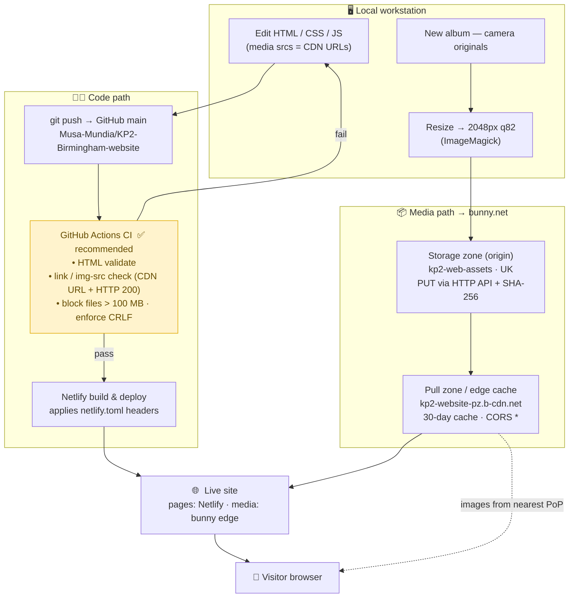

# KP2 Birmingham (Kharis Church) — Website

Static website for **KP2 Birmingham / Kharis Church**: homepage, service information,
and photo/video galleries of church events (Sunday services, midweek services, fasting
services, and other events).

## Tech at a glance

- Plain **static HTML/CSS/JS** — no build step, no framework. Pages are served/opened directly.
- **All media (photos + videos) is served from a bunny.net CDN**, not from this repo.
- Code hosted on GitHub: `Musa-Mundia/KP2-Birmingham-website`; deployed on **Netlify**.

> **History note:** the original migration briefing (`CDN-Migration-Report.docx`) recommended
> **Cloudflare R2**. The team ultimately deployed on **bunny.net** instead — the architecture and
> workflow below reflect what is actually running. See the report's *As-Built Addendum* for why.

---

## The shift in approach: media lives on the CDN, not in the repo

Originally the site loaded photos and videos from local folders sitting next to the HTML
(several thousand images plus videos). Those assets were **migrated to bunny.net**, and the
repository now contains **code only** — the media folders are git-ignored.

| | |
|---|---|
| Pull (delivery) zone | `https://kp2-website-pz.b-cdn.net/` |
| Media path prefix | everything lives under `/media/`, e.g. `https://kp2-website-pz.b-cdn.net/media/Service%20photos/...` |
| Storage zone (origin, for uploads/listing) | `kp2-web-assets` — UK region, host `uk.storage.bunnycdn.com`, accessed via bunny's HTTP Storage API with an `AccessKey` header |
| Local mirror | `C:\HTML Files\KP2-web-media\media\` — a **backup only**, verified identical to the CDN |
| Credentials (not in repo) | `C:\HTML Files\KP2-web-media\bunny-ftp-password.txt` |

### Rules of thumb

- **Every** image/video `src` in the HTML must be a `https://kp2-website-pz.b-cdn.net/media/...` URL.
- Spaces in paths are URL-encoded as `%20`.
- **Reference and list images from the CDN, never from the local mirror.** The mirror is a backup;
  the CDN is the single source of truth.

### How the CDN functions

bunny.net runs as a **two-tier system**: a **storage zone** (the origin, where the files actually
live) sitting behind a **pull zone** (the global edge cache that visitors talk to).

```
                 UPLOAD (us)                          DELIVERY (visitors)
  local media ──PUT──▶ Storage zone  ◀──pull on miss── Pull zone (edge)  ──▶ visitor browser
  (2048px jpg)  HTTP API  kp2-web-assets                kp2-website-pz         nearest of bunny's
                +SHA256    (UK origin)                   .b-cdn.net             global PoPs
```

1. **We upload** web-ready files (2048px, quality 82) into the storage zone `kp2-web-assets` via
   bunny's HTTP Storage API — `PUT` with an `AccessKey` header and an uppercase-hex `Checksum`
   (SHA-256) header the server verifies. The storage layout **mirrors** the old
   `Kharis Church – …_files/` tree under a clean `media/` prefix.
2. **A visitor's browser requests an image** from the pull-zone hostname
   `kp2-website-pz.b-cdn.net` (that's what every `src` points to).
3. **On a cache hit**, the nearest bunny edge PoP returns the file immediately. **On a miss**, the
   edge fetches it once from the storage origin, caches it, and serves it — so only the first
   request per region touches the origin.
4. **Cache & CORS:** files are served `Cache-Control: public, max-age=2592000` (30 days) and
   `Access-Control-Allow-Origin: *` (the `*` is required so the gallery's JSZip "Download all
   photos" button can fetch images cross-origin). Token authentication is **off** on the pull zone.

Practical consequences:
- The **hostname is case-insensitive** (`KP2-Website-PZ` == `kp2-website-pz`), but the **path after
  `/media/` is case-sensitive**.
- Because of the 30-day cache, **overwriting a file under the same name won't show up** until you
  purge that URL from the pull zone. Uploading under a new path/folder sidesteps this entirely.
- Photos are stored at **2048px with no separate thumbnail files** — the gallery CSS scales them.

---

## Gallery pages — how they work

Galleries show a grid of thumbnails plus a full-screen lightbox/modal, with a "Download all photos"
ZIP button. Each thumbnail tile looks like this:

```html
<div class="column">
  
</div>
```

There are **two modal patterns in the codebase** — check which one a page uses before editing it:

| Pattern | How the modal is built | Pages | What you edit |
|---|---|---|---|
| **Auto-generated** (newer) | `buildModalSlidesFromGallery()` builds the lightbox from the thumbnails at runtime — **no hardcoded modal paths** | the 5 newest Event-Services / June-Fasting pages | thumbnail grid **only** |
| **Hardcoded** (older, most pages) | modal `<div class="mySlides">` blocks are written out, one per image, with a `N / TOTAL` counter | ~49 pages, incl. all `Album-gallery-MW/` and `Album-gallery-SS/` | thumbnail grid **and** the matching modal slides |

> To tell them apart: `grep -l buildModalSlidesFromGallery <file>` → auto; otherwise it has hardcoded
> `class="mySlides"` blocks you must keep in sync with the thumbnails.

---

## Updating the website

### A. Everyday content edit (text, a page, styling)

1. Edit the HTML/CSS/JS. Keep all media `src`s pointing at `kp2-website-pz.b-cdn.net/media/...`.
2. Preview locally (open the file, or serve the folder).
3. Commit and push — this is the whole deploy step:
   ```bash
   git add -A
   git commit -m "Describe the change"
   git push            # main → GitHub → Netlify auto-deploys
   ```
4. Netlify rebuilds and publishes; `netlify.toml` re-applies the cache headers (HTML never cached,
   CSS 1 day, images/video 1 year). The live site updates within a minute or two.

> **Line endings:** repo files use **CRLF**. Some editors/tools rewrite files as LF, which makes
> `git diff` show the *whole file* as changed. Re-normalize to CRLF before committing so diffs stay
> reviewable. (See `CDN-Migration-Report.docx` → As-Built Addendum for the one-liner.)

### B. Publishing a new album (repointing a gallery to a new CDN folder)

1. **Resize + upload the photos to bunny** (web-ready, originals kept offline):
   ```powershell
   # resize a folder of camera photos to web resolution
   magick mogrify -path "<out>" -resize "2048x2048>" -quality 82 *.jpg
   ```
   Upload the resized folder into the storage zone under `media/<path>/` via the HTTP Storage API
   (`PUT` with `AccessKey` + SHA-256 `Checksum`).

2. **Get the authoritative file list from the CDN** (not the local mirror). List the target folder:
   ```
   GET https://uk.storage.bunnycdn.com/kp2-web-assets/media/<path>/
   Header:  AccessKey: <storage-zone password>
   ```
   The JSON `ObjectName` fields are the filenames. Sort them for a stable order and confirm the count.

3. **Build one thumbnail tile per image**, numbered sequentially in document order, inside the
   `<div class="gallery-row"> … </div>` block:
   ```html
   <div class="column">
     /<NAME>"
          onclick="openModal();currentSlide(<n>)" alt="Service Photo">
   </div>
   ```
   `currentSlide(n)` runs `1..N`. Encode spaces as `%20`. Replace tiles **manually, in batches of
   ~25** (no bulk find/replace scripts run against the file); add/remove tiles so the count matches
   and the numbering stays contiguous.

4. **Handle the modal according to the page's pattern** (see the table above):
   - **Auto-generated page** → do nothing; the lightbox regenerates from the thumbnails.
   - **Hardcoded page** → also replace the `<div class="mySlides">` slides so slide `N` matches tile
     `N`, and update every `N / TOTAL` counter to the new total.

5. **Verify before finishing:**
   - tile count == image count; `currentSlide` runs `1..N` with no gaps or duplicates;
   - for hardcoded pages, slide order == tile order and the `/ TOTAL` counter is correct everywhere;
   - the filenames in the HTML exactly match the CDN listing (diff them);
   - spot-check that `src` URLs return **HTTP 200**.

6. **Remove redundant sections** — leftover tiles, stale hardcoded modal slides, or references to a
   different event's folder.

7. Commit and push (Section A, step 3) to deploy.

---

## CI/CD pipeline

**Today:** code is pushed to GitHub `main` and Netlify deploys from it; media is uploaded separately
to bunny.net. There is **no automated checking** between push and publish (`.github/workflows` is
empty).

**Most optimal pipeline** — add a lightweight GitHub Actions gate so a broken page can't reach the
live site, keeping the two content paths (code vs. media) clearly separated:



**Why this shape is optimal for this project:**

- **Two independent pipelines.** Heavy media never travels through git or Netlify — it goes straight
  to bunny and is delivered from the edge. Git/Netlify only ever move the <10 MB of code, so pushes
  and deploys stay fast and can't hit GitHub's 100 MB file ceiling again.
- **A cheap safety gate.** The recommended GitHub Actions job (highlighted) runs in seconds on plain
  static files and catches the failure modes that actually bite here: a stray local/relative media
  path, a dead CDN URL, an accidental large binary, or an LF/CRLF flip — *before* Netlify publishes.
- **Auto-deploy, no manual step.** Once GitHub → Netlify is linked, publishing is just `git push`;
  Netlify applies the caching policy in `netlify.toml` on every deploy.

**To reach it from today:** (1) confirm the Netlify site is connected to the GitHub repo for
auto-deploy; (2) add a `.github/workflows/ci.yml` running an HTML validator + link/src checker on
pull requests and pushes to `main`.

> `robots.txt` currently **disallows all crawling** (`Disallow: /`) — appropriate pre-launch, but
> remember to relax it when the site should be publicly indexed.

---

## Repo layout (code only)

- `Index.html` — homepage
- `Album-gallery-Event-Services/`, `Album-gallery-MW/`, `Album-gallery-SS/`, `Gallery-Selection/` —
  event galleries and selection pages
- `External_demo.css` and per-page `<style>` blocks — styling
- `netlify.toml` — deploy/cache-header rules
- Media folders — **git-ignored**; served from the CDN

> For CDN migration history, zone details, upload lessons, and the as-built architecture, see
> `CDN-Migration-Report.docx`.
